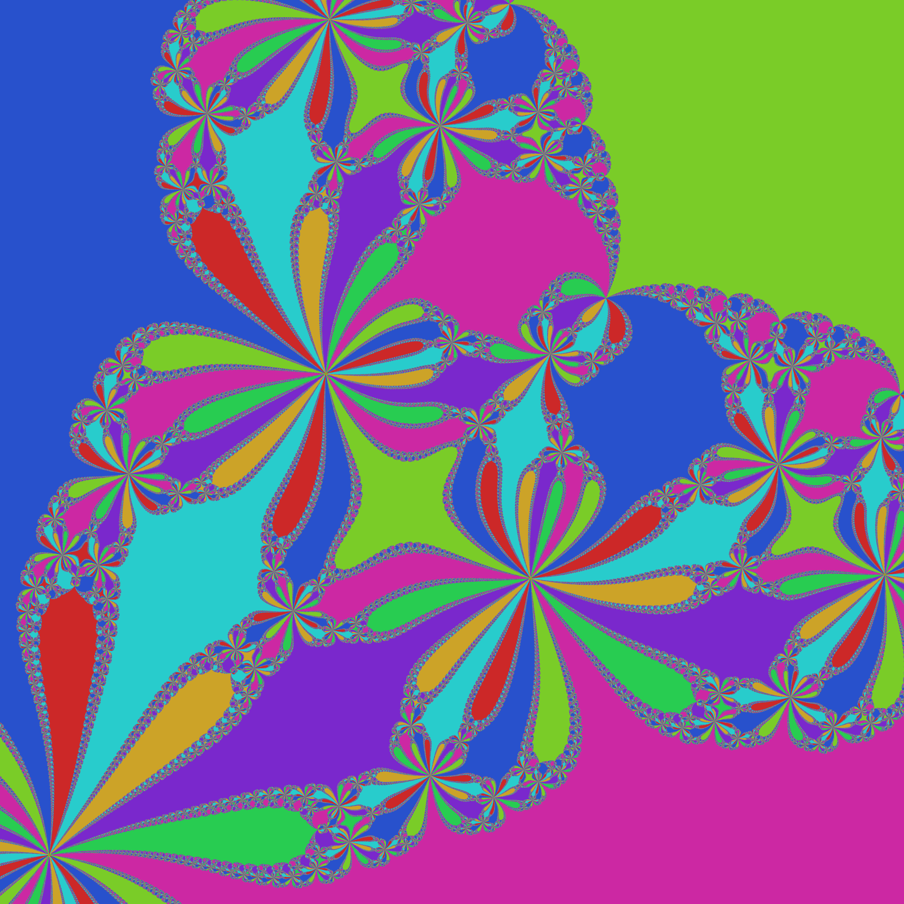
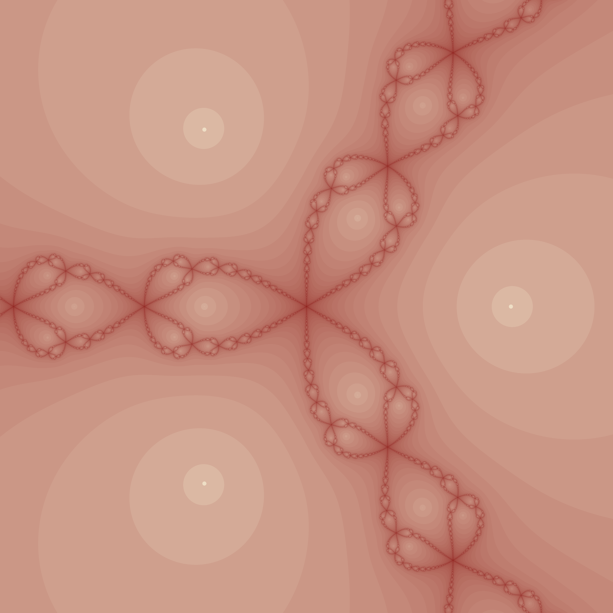
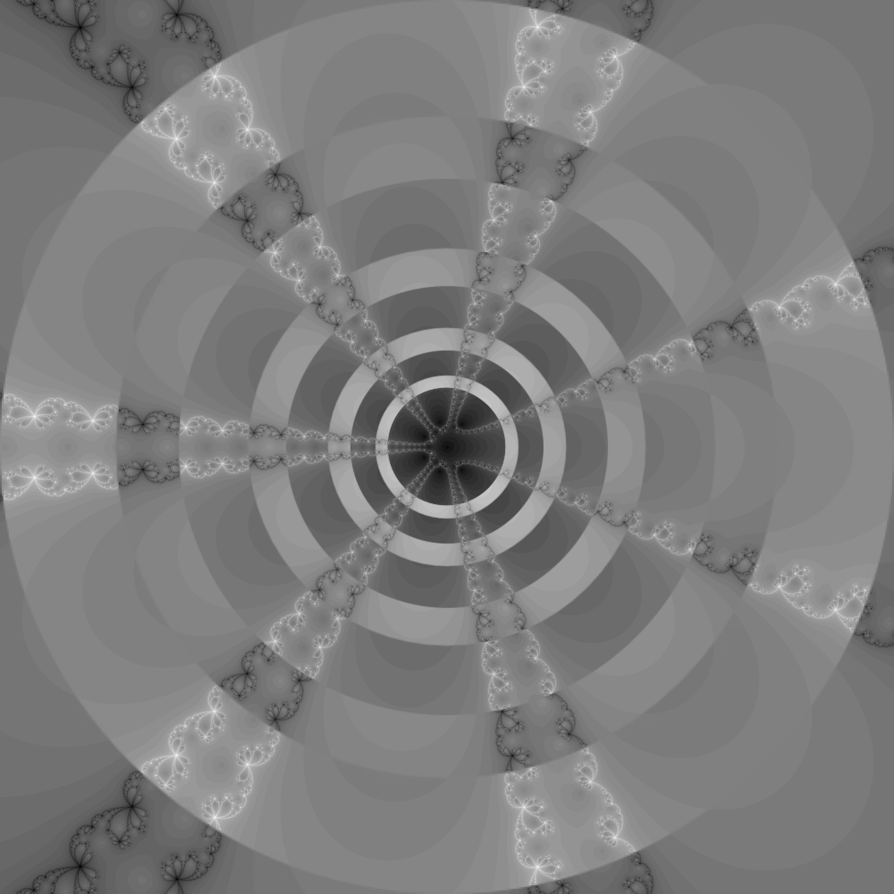

# Newton Fractal Generator

A program that generates Newton fractals by applying the Newton-Raphson method root-finding algorithm to many different points, and then coloring each point based on some criteria.

## Example Output

  
  
  
  

